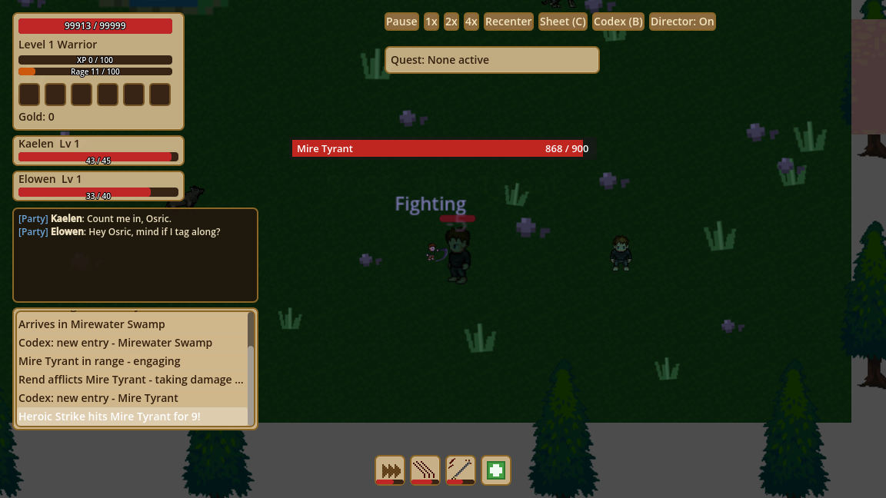
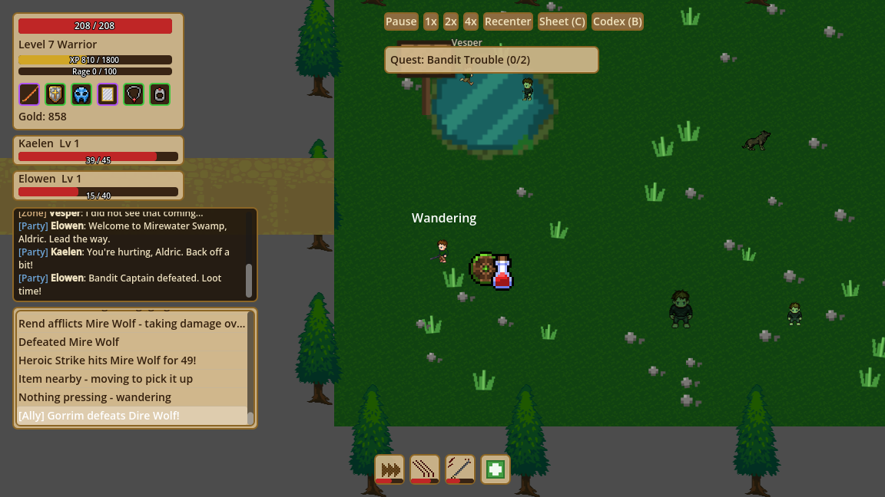
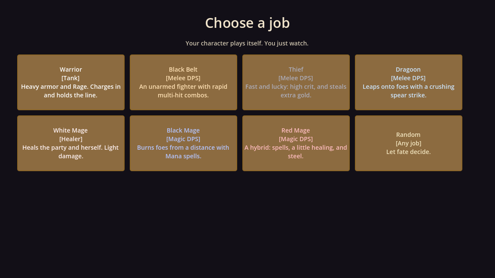
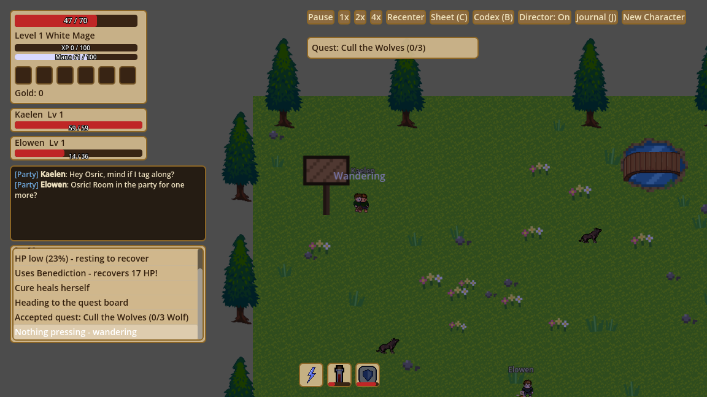
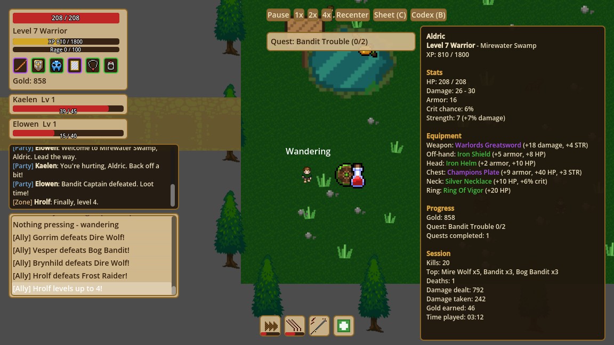
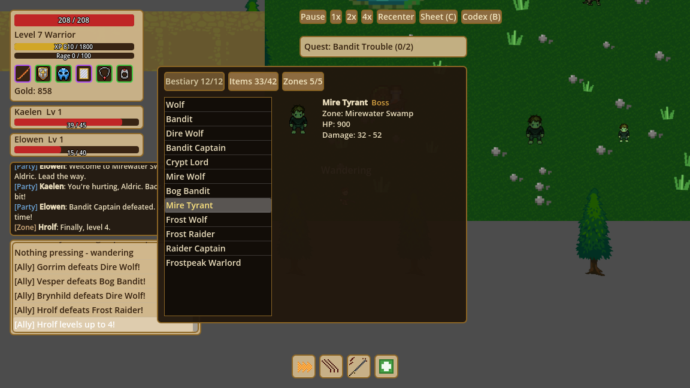

# AI World Spectator

A single-player fantasy game where you don't play — you **watch**. An AI character
autonomously explores a small meadow, fights wolves and bandits, loots gear,
rests when hurt, and levels up, while a spectator HUD narrates every decision.

There is no player-controlled character and no multiplayer. The "AI" is a local,
rule-based state machine (no network or LLM calls), so it runs fast, free, and
offline.

Built with **Godot 4.7** (GDScript, 2D top-down).

## Screenshots









| Character sheet (`C`) | Codex (`B`) |
|---|---|
|  |  |

## What you'll see

- **Five zones** — Thornfield Meadow, Blackthorn Forest, the Sundered Crypt,
  Mirewater Swamp and Frostpeak Pass — linked by corridors along one east-west
  road. Each has its own enemies that respawn after being defeated, and the
  character travels between them in order, skipping zones above its level.
  Later zones have tougher enemies and bosses: the Bandit Captain, the Crypt
  Lord, the Mire Tyrant, the Raider Captain and the Frostpeak Warlord. Bosses
  always drop a guaranteed item and 5x gold.
- **An autonomous character** that cycles through wandering, chasing, fighting,
  fleeing, resting, and looting, choosing each action from simple priority rules
  (for example: flee or rest when HP is low, fight when an enemy is in range).
  The character has a name, and simulated players talk to it in chat.
- **Loot, gear and leveling** — enemies drop gear across six slots (weapon,
  off-hand, head, chest, neck, ring) with multiple stats each, plus gold and
  potions. The character equips only real upgrades for its class and level and
  ignores the rest; armor reduces damage taken. Kills grant XP and level-ups
  increase HP and damage, up to a level cap of 10. Random drops are
  level-aware, so each zone drops gear suited to it.
- **Made to be watched** — hit flashes and knockback, damage numbers that grow on crits and boss hits, camera shake on
  heavy blows, a name banner and health bar for bosses, slow motion on the killing blow, and an auto-director camera
  that frames boss fights and pulls out while travelling.
- **Jobs** — seven Final Fantasy style jobs (Warrior, Black Mage, White Mage, Thief, Black Belt, Dragoon, Red Mage) with roles, resources and abilities; pick one on the character select screen or press New Character; allies have jobs too, and the White Mage ally heals the party.
- **Job switching** — the hero keeps a level and a gear set for every job and, once a job reaches level 10,
  walks to the Job Crystal in Thornfield Meadow and takes up the least-trained job (a new job starts two levels below
  the best one and inherits usable gear), so all seven jobs get leveled over a long run.
- **Five-man dungeon** — the Hollowed Vault, an instanced three-room dungeon entered from the Vault Gate in the Sundered
  Crypt. A role party of five (tank, healer, three damage) forms at the gate and is level-synced; enemies attack the tank, the
  Hollow King telegraphs heavy strikes and summons adds, and clearing it drops dungeon-only epics.
- **Personality and story** — each run rolls a trait (Steady, Cautious, Reckless, Greedy or Explorer) that changes
  when the character flees, rests, loots and moves on; a narrator tells the story in the Story chat channel; a recap card
  follows every death; and a journal lists the run's milestones.
- **A spectator HUD**
  - HP bar, XP bar, level, six equipment slots with rarity-colored icons and hover tooltips, and a gold counter
  - An activity log explaining what the AI is doing and why
  - A floating label above the character showing its current action
  - Floating damage and heal numbers
  - A health bar over whichever enemy is currently being fought
  - A character sheet (stats, gear, quest, kills/deaths/damage/gold statistics)
  - A target frame showing the enemy being fought
  - Party frames for the character's grouped allies (name, level, HP)
  - A codex that fills in as the character discovers enemies, items and zones
  - An ally chat panel: allies greet, congratulate, warn and chat in `[Party]` and `[Zone]` channels
  - Pause / 1x / 2x / 4x speed controls

## Running it

1. Install [Godot 4.7](https://godotengine.org/download) (the .NET edition was
   used for development; the game itself is pure GDScript).
2. Clone this repository:
   ```bash
   git clone https://github.com/HexaLoid/ai-world-spectator.git
   ```
3. Open Godot, choose **Import**, and select the `project.godot` file.
4. Press **F5** (Play). The main scene is `scenes/Main.tscn`.

The first time the project opens, Godot imports the art assets, which takes a few
seconds. If sprites or icons look missing on first launch, close and reopen the
project once so the import finishes.

## Controls

You can't control the character, but you can control how you watch:

| Input | Action |
|---|---|
| Left-click + drag | Pan the camera (stops following the character) |
| Mouse wheel | Zoom in / out |
| **Recenter** button | Snap the camera back to following the character |
| **Director** button | Toggle the auto-director camera (boss framing, travel pull-out). Dragging or scrolling takes over; Recenter hands it back |
| **Pause / 1x / 2x / 4x** buttons | Change simulation speed |
| **C** key / **Sheet (C)** button | Open or close the character sheet |
| **B** key / **Codex (B)** button | Open or close the codex (bestiary, items, zones) |
| **J** key / **Journal (J)** button | Open or close the journal (the run's milestones, newest first) |
| **New Character** button | Return to the character select screen and start a new run |

## Project layout

```
scenes/
  Main.tscn                 Root scene: world, character, camera, HUD
  world/                    World.tscn plus one scene per zone (spawn points, tree border)
  entities/                 Character, Enemy, SpawnPoint, item pickup
  ui/                       Spectator HUD and floating damage text
scripts/
  ai/ai_decision.gd         Picks the character's next state from context
  entities/                 Character, enemy, spawn point, item pickup logic
  systems/                  Combat, leveling, item scoring, stat rules, and the
                            enemy / zone / quest / loot data tables
  ui/                       HUD, camera controller, health bar, floating text
  autoload/game_state.gd    Signal hub between gameplay and UI
tests/                      Headless test suites (run with: godot --headless --path . --script res://tests/run_tests.gd)
assets/
  sprites/, tiles/, icons/  Third-party art (see Credits)
  theme/spectator_theme.tres  Parchment-style HUD theme
docs/superpowers/           Design specs and implementation plans
```

Gameplay code never talks to the UI directly. It emits signals on the `GameState`
autoload (HP changes, damage dealt, combat target changes, log events), and the
HUD listens.

## Design docs

The project was built in three phases, each with a written design spec and a
task-by-task implementation plan under `docs/superpowers/`:

1. **Core game** — AI state machine, combat, leveling, loot, zone, spectator UI
   (`2026-09-21-ai-played-world-spectator-design.md`)
2. **Visual art upgrade** — replaced placeholder squares with animated sprites and
   a tree-line border (`2026-09-22-visual-art-upgrade-design.md`)
3. **HUD/UI upgrade** — themed HUD, equipment icons, floating damage numbers,
   enemy health bar, action label (`2026-09-23-hud-ui-upgrade-design.md`)

## Credits

All third-party art is credited in [`assets/CREDITS.txt`](assets/CREDITS.txt),
including per-author attribution files kept next to the assets.

- Character, bandit, and terrain art: [Liberated Pixel Cup](https://lpc.opengameart.org)
  (CC-BY-SA 3.0 and compatible licenses)
- Wolf: [LPC Wolf Animation](https://opengameart.org/content/lpc-wolf-animation)
  by William.Thompsonj and Stephen "Redshrike" Challener
- HUD icons: [Kyrise's Free 16x16 RPG Icon Pack](https://opengameart.org/content/kyrises-free-16x16-rpg-icon-pack)
  (CC-BY 4.0)

The game's own source code is released under the [MIT License](LICENSE). The
third-party art keeps its own licenses (CC-BY-SA / CC-BY, see above), which apply
to the art itself and not to the code.
